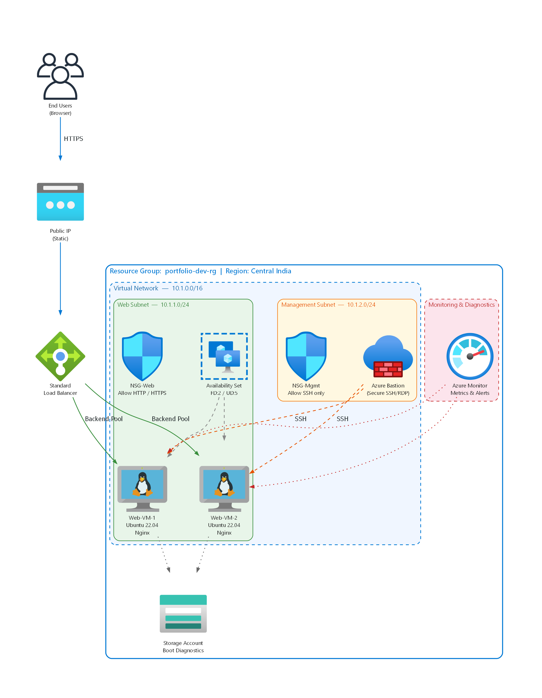
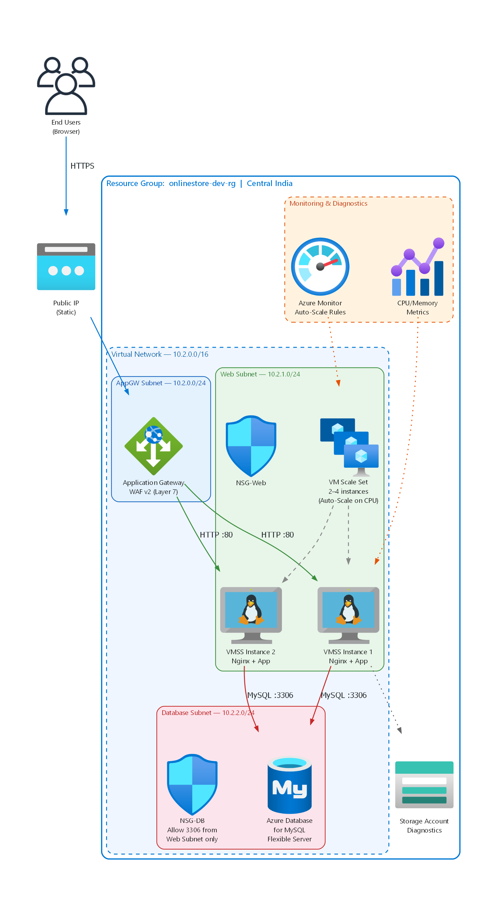
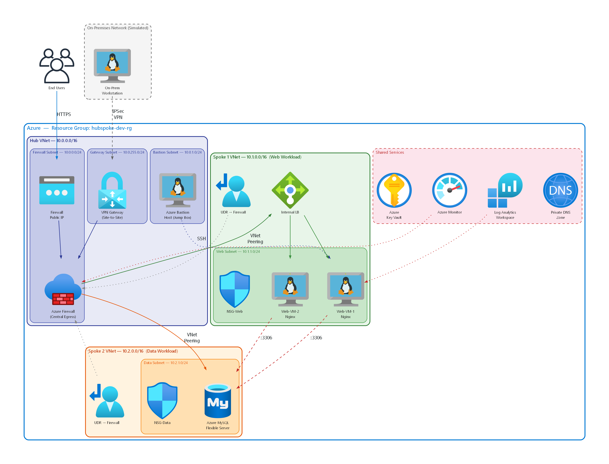
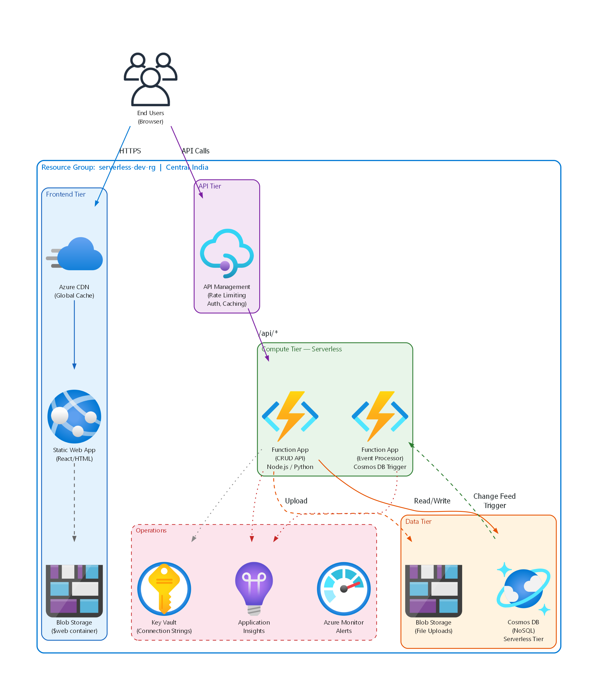
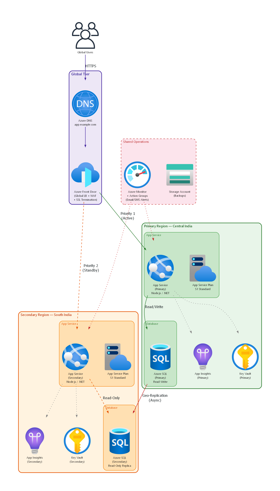

# ☁️ Azure Practice Scenarios

A progressive, hands-on learning path for **Azure Cloud Infrastructure** — from basic VM deployments to multi-region disaster recovery.

This repository contains:
- **Terraform IaC** — Automated infrastructure deployment as code
- **5 Azure Portal Labs** — Step-by-step guides to build real infrastructure manually through the Azure Portal UI

Each lab includes professional architecture diagrams, concept explainers, exact portal field values, and cleanup instructions to avoid surprise billing.

---

## 📐 Architecture Diagrams

<p align="center">
  
  &nbsp;
  
  &nbsp;
  
  &nbsp;
  
  &nbsp;
  
</p>

---

## 🗺️ Learning Path

| Lab | Difficulty | What You'll Build | Key Azure Services | Time |
|-----|------------|-------------------|--------------------|------|
| [**Lab 01**](Lab01-LoadBalanced-Nginx/Lab01-LoadBalanced-Nginx-Guide.md) | 🟢 Moderate | Load-balanced Nginx website on 2 VMs | VNet, Subnets, NSGs, Standard LB, Availability Set, VMs, Cloud-Init | 60–90 min |
| [**Lab 02**](Lab02-AppGateway-VMSS-MySQL/Lab02-AppGateway-VMSS-MySQL-Guide.md) | 🟡 Advanced | 3-tier online store with auto-scaling | Application Gateway WAF v2, VM Scale Set, Azure MySQL Flexible Server, Subnet Delegation | 90–120 min |
| [**Lab 03**](Lab03-HubSpoke-Firewall/Lab03-HubSpoke-Firewall-Guide.md) | 🔴 Expert | Enterprise hub-spoke network topology | Azure Firewall, VNet Peering, UDR Route Tables, Azure Bastion, Key Vault, Log Analytics, KQL | 2–3 hrs |
| [**Lab 04**](Lab04-Serverless-API/Lab04-Serverless-API-Guide.md) | 🔴 Expert | Serverless task manager API | Azure Functions, Cosmos DB, API Management, Static Web App, Application Insights, Managed Identity | 90–120 min |
| [**Lab 05**](Lab05-MultiRegion-FrontDoor/Lab05-MultiRegion-FrontDoor-Guide.md) | 🟣 Expert+ | Multi-region HA with automatic failover | Azure Front Door, App Service, SQL Geo-Replication, Failover Groups, Azure Monitor, Action Groups | 2–3 hrs |

> **Recommended approach:** Complete the labs in order. Labs 1–3 cover IaaS (VMs & networking), Lab 4 transitions to PaaS/Serverless, and Lab 5 is the capstone covering multi-region disaster recovery.

---

## 🏗️ Terraform IaC (Reference Implementation)

The root directory contains a complete Terraform project that automates the Lab 01 architecture using Apache instead of Nginx. Use it to compare **manual Portal deployment** vs **Infrastructure as Code**.

```bash
# Initialize Terraform
terraform init

# Preview what will be created
terraform plan

# Deploy the infrastructure
terraform apply

# Tear everything down
terraform destroy
```

### Terraform Resources Deployed

| Resource | Description |
|----------|-------------|
| Resource Group | `portfolio-dev-rg` in Central India |
| Virtual Network | `10.0.0.0/16` with public and private subnets |
| NSGs | Separate rules for web traffic and management |
| Standard Load Balancer | Public-facing with health probes and NAT rules |
| Availability Set | FD:2 / UD:5 for high availability |
| 2× Ubuntu 22.04 VMs | Apache2 installed via cloud-init |

---

## 📂 Repository Structure

```
Azure-Practice-Scenarios/
│
├── README.md                          ← You are here
├── .gitignore
│
├── ── Terraform IaC ──────────────────
├── providers.tf                       ← Azure RM provider config
├── variables.tf                       ← Input variable definitions
├── terraform.tfvars                   ← Deployment values
├── locals.tf                          ← Naming & tagging logic
├── network.tf                         ← VNet, Subnets, NSGs
├── loadbalancer.tf                    ← Standard LB + health probes
├── compute.tf                         ← Availability Set + VMs
├── nat_rules.tf                       ← SSH port forwarding rules
├── outputs.tf                         ← LB IP + SSH connection strings
├── generate_diagram.py                ← Terraform architecture diagram
├── azure_web_infra.png                ← Generated diagram
├── scripts/
│   └── cloud-init.yaml               ← Apache2 bootstrap config
│
├── ── Portal Practice Labs ───────────
├── Lab01-LoadBalanced-Nginx/          🟢 IaaS — VMs + Load Balancer
│   ├── Lab01-LoadBalanced-Nginx-Guide.md
│   ├── Lab01-Architecture.png
│   └── generate_diagram.py
│
├── Lab02-AppGateway-VMSS-MySQL/       🟡 IaaS — AppGW + Auto-Scaling
│   ├── Lab02-AppGateway-VMSS-MySQL-Guide.md
│   ├── Lab02-Architecture.png
│   └── generate_diagram.py
│
├── Lab03-HubSpoke-Firewall/           🔴 IaaS — Enterprise Networking
│   ├── Lab03-HubSpoke-Firewall-Guide.md
│   ├── Lab03-Architecture.png
│   └── generate_diagram.py
│
├── Lab04-Serverless-API/              🔴 PaaS — Serverless + NoSQL
│   ├── Lab04-Serverless-API-Guide.md
│   ├── Lab04-Architecture.png
│   └── generate_diagram.py
│
└── Lab05-MultiRegion-FrontDoor/       🟣 DR — Multi-Region HA (Capstone)
    ├── Lab05-MultiRegion-FrontDoor-Guide.md
    ├── Lab05-Architecture.png
    └── generate_diagram.py
```

---

## 🧰 Prerequisites

| Tool | Purpose | Required For |
|------|---------|--------------|
| [Azure Account](https://azure.microsoft.com/free/) | Cloud platform | All labs |
| [Terraform](https://developer.hashicorp.com/terraform/install) | Infrastructure as Code | IaC project only |
| [Python 3.x](https://python.org) | Diagram generation | Regenerating diagrams |
| [Graphviz](https://graphviz.org/download/) | Graph rendering engine | Regenerating diagrams |
| `pip install diagrams` | Python diagrams library | Regenerating diagrams |

---

## 💰 Cost Warning

> **⚠️ Azure resources cost real money.** Each lab guide includes estimated costs and cleanup steps. Always delete your resource group after completing a lab.

| Lab | Estimated Cost | Most Expensive Resource |
|-----|---------------|------------------------|
| Lab 01 | ~₹50–100 | 2× Standard_B1s VMs |
| Lab 02 | ~₹200–400 | Application Gateway WAF v2 (~₹500/day) |
| Lab 03 | ~₹800–1,500 | Azure Firewall (~₹1,000/day) + Bastion (~₹350/day) |
| Lab 04 | ~₹100–300 | API Management Developer tier (~₹150/day) |
| Lab 05 | ~₹500–1,000 | 2× App Service S1 + Azure SQL × 2 regions |

**Cleanup:** Delete the resource group → everything inside is deleted.

---

## 🧠 Skills Covered

```
Lab 01 (IaaS)             Lab 02 (IaaS)             Lab 03 (Networking)
──────────────            ──────────────            ───────────────────
☑ Resource Groups         ☑ Application Gateway     ☑ Hub-Spoke Topology
☑ Virtual Networks        ☑ WAF (OWASP Rules)       ☑ Azure Firewall
☑ Subnets & CIDR          ☑ VM Scale Sets           ☑ VNet Peering
☑ Network Security Groups ☑ Auto-Scale Rules        ☑ Route Tables (UDR)
☑ Availability Sets       ☑ Azure MySQL (PaaS)      ☑ Azure Bastion
☑ Linux VMs + Cloud-Init  ☑ Subnet Delegation       ☑ Internal Load Balancer
☑ Standard Load Balancer  ☑ Network Segmentation    ☑ Key Vault
☑ Health Probes + NAT     ☑ AppGW Health Probes     ☑ Log Analytics + KQL

Lab 04 (Serverless)       Lab 05 (Disaster Recovery)
───────────────────       ────────────────────────────
☑ Azure Functions         ☑ Azure Front Door (Global LB)
☑ Cosmos DB (NoSQL)       ☑ Active-Standby Failover
☑ API Management          ☑ App Service (PaaS Web Hosting)
☑ Static Web App          ☑ SQL Geo-Replication
☑ Application Insights    ☑ Failover Groups
☑ Managed Identity        ☑ Azure Monitor + Action Groups
☑ Event-Driven Triggers   ☑ RTO/RPO Design
☑ Key Vault Integration   ☑ Cross-Region Architecture
```

---

## 📜 License

This project is for educational purposes. Feel free to use, modify, and share.

---

<p align="center">
  <strong>Built for learning Azure infrastructure from the ground up.</strong><br/>
  <em>Start with Lab 01 → progress through IaaS → transition to PaaS → master DR with Lab 05.</em>
</p>
